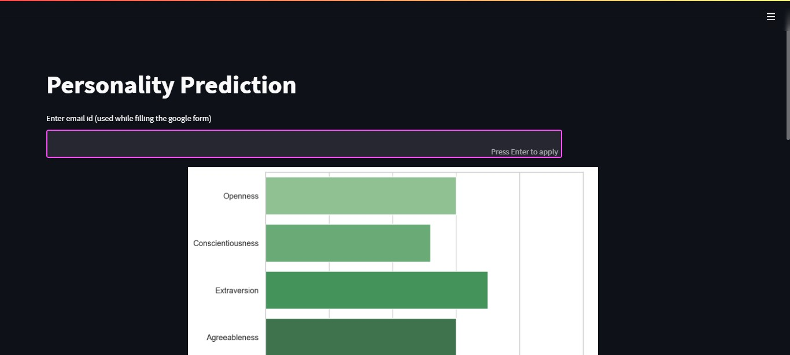

# personalityPrediction
This project uses the Big Ocean Five dataset available on the [kaggle](https://www.kaggle.com/code/akdagmelih/five-personality-clusters-k-means) website

## Big Ocean Five Dataset
Big Five personality traits, also known as the five-factor model (FFM) and the OCEAN model, is for grouping different personality traits.
This theory uses descriptors of common language and suggests five broad dimensions commonly used to describe the human personality and psyche. The theory identifies five factors:
    - Openness to experience (inventive/curious vs. consistent/cautious)
    - Conscientiousness (efficient/organized vs. easy-going/careless)
    - Extroversion (outgoing/energetic vs. solitary/reserved)
    - Agreeableness (friendly/compassionate vs. challenging/detached)
    - Neuroticism (sensitive/nervous vs. secure/confident)

## Processing of the dataset
Cleaned the dataset.
The dataset contained answers to the questions related to the five personality traits.
The answer was in the form of an integer i.e. **1 = Disagree** , **3 = Neutral** , **5 = Agree**
Using this information, we processed the dataset using unsupervised learning.
In this case K-means was used for model generation.
Predictions here are made from the saved model.

## FrameWork used here is Streamlit
To install streamlit; 
run the following in your terminal:

`pip install streamlit `

## Predictions made in this project

The data was collected via the google forms, stored in google sheets in the form of csv file.
Data is suppoesed to be collected in a similar manner as the dataset; answers to the available questions i.e rating from 1-5.
Lastly the predictions are made using email-id as the key to the desired dataframe.

**Below is a simple interface about how the result will look like**

### To run project
In the directory of the file *app.py* Run the following:

`streamlit run app.py`

